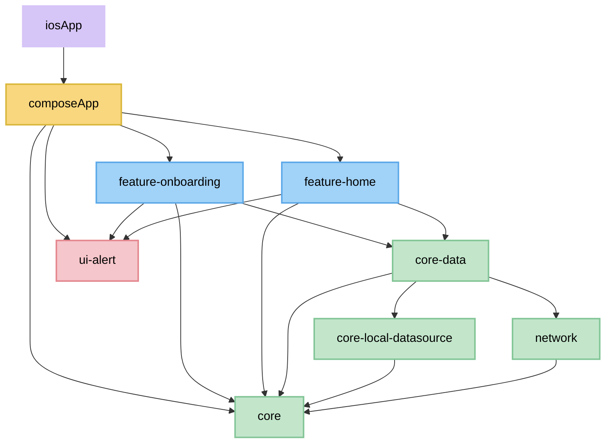
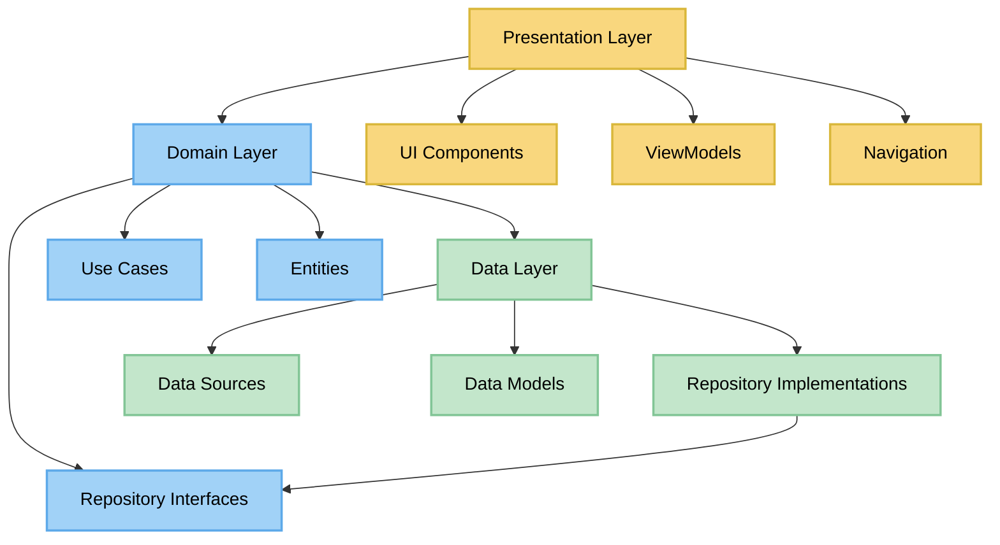
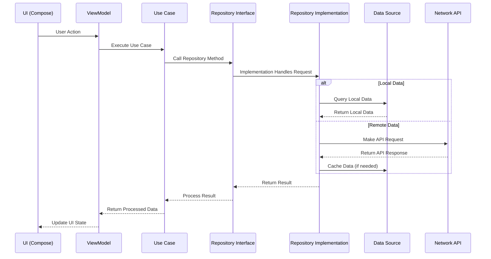

# KMP Clean Architecture Template - Architecture Diagram

## This document provides a visual representation of the project architecture using Mermaid diagrams.

## Module Structure and Dependencies

## Clean Architecture Layers

## Module Mapping to Clean Architecture

```mermaid
graph TD
    %% Architecture Layers
    presentation[Presentation Layer]
    domain[Domain Layer]
    data[Data Layer]

    %% Modules
    composeApp[composeApp]
    featureOnboarding[feature-onboarding]
    featureHome[feature-home]
    uiAlert[ui-alert]
    core[core]
    coreData[core-data]
    coreLocalDatasource[core-local-datasource]
    network[network]

    %% Mapping
    presentation --> composeApp
    presentation --> featureOnboarding
    presentation --> featureHome
    presentation --> uiAlert

    domain --> core

    data --> coreData
    data --> coreLocalDatasource
    data --> network

    %% Styling
    classDef presentationLayer color:#000, fill:#f9d77e,stroke:#d9b73a,stroke-width:2px
    classDef domainLayer color:#000, fill:#a1d2f7,stroke:#5da9e9,stroke-width:2px
    classDef dataLayer color:#000, fill:#c3e6cb,stroke:#82c596,stroke-width:2px

    class presentation presentationLayer
    class domain domainLayer
    class data dataLayer

    class composeApp,featureOnboarding,featureHome,uiAlert presentationLayer
    class core domainLayer
    class coreData,coreLocalDatasource,network dataLayer
```

## Data Flow

## This architecture follows the principles of Clean Architecture, ensuring separation of concerns and maintainability while enabling code sharing across platforms.
